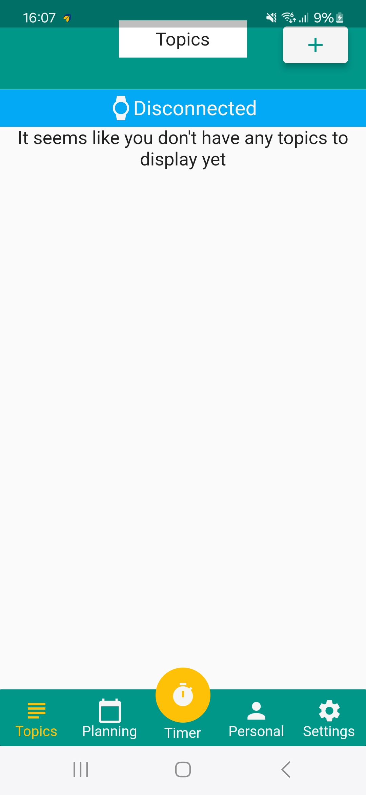
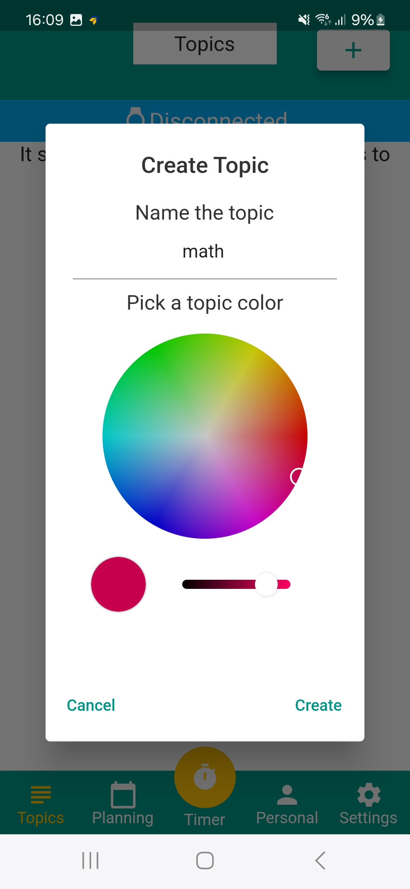
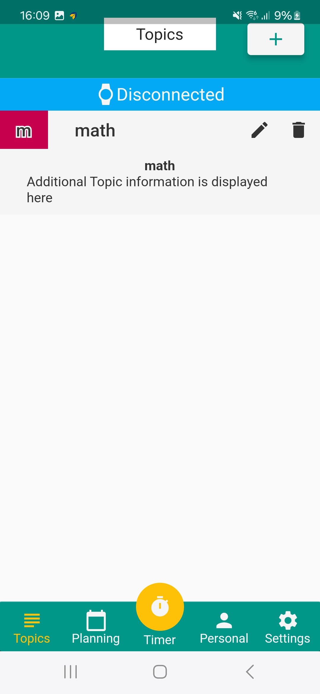
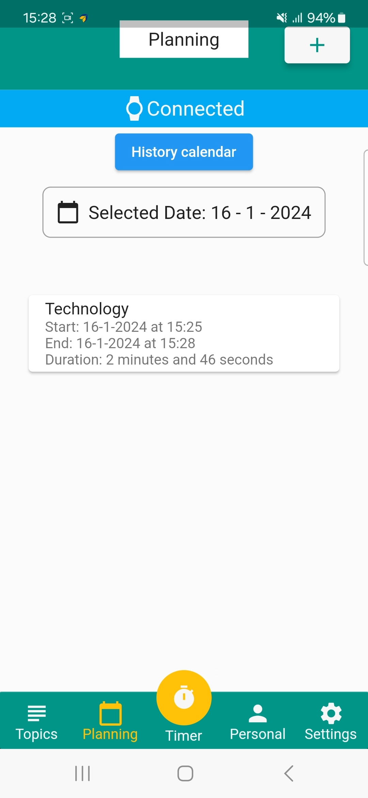
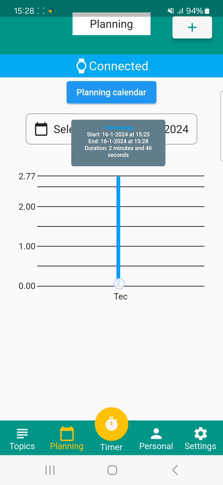
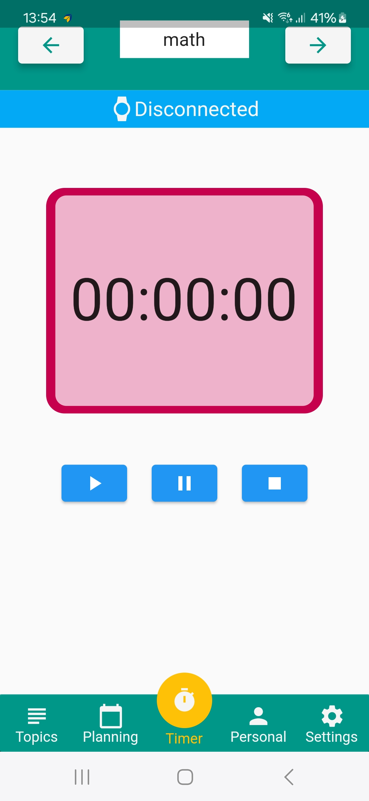

# TopicTimer

## TopicWatch

The TopicWatch is a watch like embedded device for the TopicTimer. It connects to the mobile app using BLE technology. The device is a [lilygo t-display-s3](https://github.com/Xinyuan-LilyGO/T-Display-S3), an ESP with a touchscreen display mounted on it. Every screen that can be seen is custom made. Navigation through the multiple screens can be done using gestures on the touchscreen.

### Home screen
The home screen is the base screen that displays four things. In the middle the time is displayed, this time is synced with the mobile app everytime they connect. The same goes for the date, which can be seen on the bottom of the screen. In the top right corner of the watch the connection status is shown. Lastly, on the bottom left a settings icon is visible. Clicking this will make the settings screen visible.
To quickly change your screen back to the home screen, the home button that is present on the [lilygo t-display-s3](https://github.com/Xinyuan-LilyGO/T-Display-S3) can be clicked.

Navigation on this screen while being on the home screen is as follows:

|Left to right|Right to left|Top to bottom|Bottom to top|
|-------------|-------------|-------------|-------------|
|Open settings screen|Open first topic screen|Nothing|Nothing|

### Settings screen
From the settings screen the user can customize a lot about the TopicWatch. The user can click on one of the options to go into edit mode. **While in edit mode** they can swipe from **left to right** to decrease the value of the selected option, **right to left** to increase the value of the selected option, or **double tap** the screen to confirm the setting value.

The options availbe to customize are:

|Setting name|Minimal value|Maximum value|Description|
|------------|:-----------:|:-----------:|-----------|
|Minimal tracking minutes|0|1|The minimal amount of minutes to track before the data is considered valid.|
|Border size|0|10|The size of the border.|
|Vibration level|0|10|The strength of the vibrations (0 is off).|
|Vibration pattern|1|5|The vibration pattern to play when feedback is being given|
|Sound level|0|10|The strength of the sound (0 is off).|
|Sound pattern|1|5|The sound pattern to play when feedback is being given|

Navigation on this screen is as follows:

|Left to right|Right to left|Top to bottom|Bottom to top|
|-------------|-------------|-------------|-------------|
|Nothing|Open home screen|Previous settings screen|Next settings screen|

### Topic screen
A topic screen has the same information shown as the home screen and more. Besides the home screen content, this screen also shows you the information about a topic. These topics can be made/edited using the mobile app. The border (if not set to 0 in the settings) has the color of the topic that the user choose in the app. This is so that it can be easier to tell which topic is currently selected.  In the middle section at the top the user can also see how far along their topic list they currently are (e.g. 1/3) and the topic name. When viewing a topic screen, the user can **double tap** to start tracking that topic. The display will now show the time just above the date and in the middle, the time they have been tracking for is shown. By simply **double tapping** again, the tracking will stop, the data will be send to the phone if there is a connection and the amount of time was bigger than set in the settings. If there is no connection at the time the tracking is stopped, the data will be stored in a buffer and will be send once there is a connection.

|Left to right|Right to left|Top to bottom|Bottom to top|
|-------------|-------------|-------------|-------------|
|Open previous topic or open home screen|Open next topic (if available)|Nothing|Nothing|

## TopicTimer Mobile App
The TopicTimer Mobile App is an additional tool that completes the functionalities of the TopicWatch. It connects to the TopicWatch using BLE technology. It was developed using Darts Flutter framework.

### Topics screen
The Topics screen is the far left choice in the mobile apps navigational bar. In the Topics screen the user can add new topics he wants to track with the "+" button in the top-right corner of the screen.  
  
After choosing the name and color of your new topic, the user can press the create button in the pop up module and a new topic is created and added to the current list of that users topics.  

  
At this point the topics are editable and removable with the help of the 2 buttons located right from each topics name.

### Planning screen
The Planning screen is the second choice from the left side of the mobile apps navigational bar. In the Planning screen the user can view his tracked data in 2 different graphical views. The user can select a date with the calendar selector module and see which topics did he track and for how long did he track those topics for on that particular day.  

### Timer screen
The Timer screen is the third choice from the left side or the middle option of the mobile apps navigational bar. The Timer screen contains a timer module which serves as a replacement for the physical TopicWatch. Different topics can be changed in the top bar of the mobile app. Once the selected topic is locked in, the user can start tracking the time spent studying/working on that topic by clicking the far left play button. The user can pause the time tracking with the middle pause button, and he can finalize tracking that topic by clicking the far right stop button. Once the stop button is pressed, the tracked time data from the tracked topic will be added in the planning page.  

### Personal screen
The Personal screen is the fourth choice from the left side of the mobile apps navigational bar. Here the user can view and change his profile image, name, school and account password.  

### Settings screen